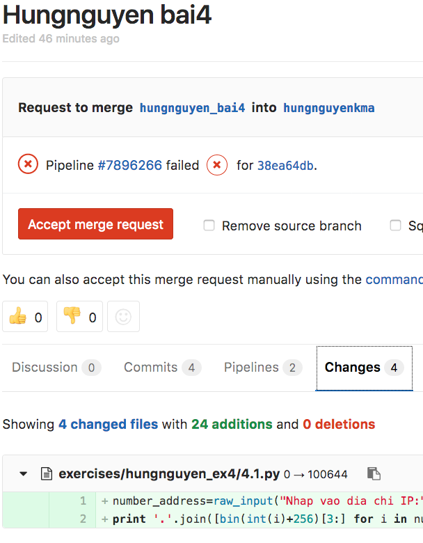

Exercises
=========

Hướng dẫn làm bài tập
---------------------

Tất cả bài tập phải làm vào trong thư mục ``exercises``, sửa nội dung của các file `.py` đã có tương ứng với bài tập cần làm.
Học xong chương 3 thì làm bài 'ex3_*.py' như ex3_1.py, ex3_2.py ...

Riêng `ex35_*.py` là bài làm thêm cho học viên từ buổi 3 đến
buổi 5.

Nếu chưa học git, paste code vào đây (set Public) để nộp bài:
https://gitlab.com/snippets/new

Clone (download) repo của lớp học về máy nếu chưa clone::

  git clone https://gitlab.com/pyfml/pyfml.git pyfml

*MỖI LẦN* làm bài tập, làm như sau:

Vào thư mục ``pyfml``, kiểm tra branch::

  cd pyfml # chuyển đến pyfml
  git branch

Kết quả::

  * master

Nếu không thấy kết quả có ``* master``, hãy chuyển sang branch master trước::

  git checkout master

Lấy phiên bản mới nhất của branch master từ GitLab về máy::

  git pull origin master

Tạo branch mới để nộp bài::

  git checkout -b pymi_XXYYZZ_YOURNAME_lesson

Ví dụ học viên khoá 1704 Hà Nội, tên HungNV, nộp bài 3::

  git checkout -b pymi_1704HN_hungnv_bai3

Sau đó làm bài tập và lưu vào git như sau:

Ví dụ bài 3.1 sẽ sửa file::

  ex3_1.py

Nội dung của file này chứa đề bài và lời giải của bài toán.
Học viên sửa nội dung trong function solve() để trả về kết quả
phù hợp.

Và chạy file này với lệnh::

  python ex3_1.py  # Trên Linux/Mac, gõ python3 để đảm bảo dùng đúng phiên bản.

Học viên cài và sử dụng
`flake8 <http://flake8.pycqa.org/en/latest/index.html#quickstart>`_
để kiểm tra code viết đúng chuẩn chưa (chỉ bắt buộc sau buổi 4)::

  flake8 ex3_1.py

Nếu thấy không in ra gì tức đã đúng chuẩn.

Làm bài xong học viên lưu vào git::

  git add ex3_1.py
  git commit -m 'add'

Tiếp tục làm cho đủ bài tập rồi đưa bài tập lên trang GitLab::

  git push origin YOUR_BRANCH  # CHÚ Ý, phải dùng đúng tên branch của bạn

Nếu thấy thông báo như sau là đã thành công::

  ...
  Counting objects: 2, done.
  Delta compression using up to 8 threads.
  Compressing objects: 100% (2/2), done.
  Writing objects: 100% (2/2), 234 bytes | 0 bytes/s, done.
  Total 2 (delta 1), reused 0 (delta 0)
  remote:
  remote: To create a merge request for hvn_123, visit:
  remote:   https://gitlab.com/pyfml/pyfml/merge_requests/new?merge_request%5Bsource_branch%5D=hvn_123
  remote:
  To git@gitlab.com:pyfml/pyfml.git
   * [new branch]      hvn_123 -> hvn_123

Mở đường dẫn ở trên để tạo Merge Request (MR).
Trong phần ``Description``, @nick_người_khác để báo cho họ. Cụ thể, mọi MR phải
@hvn_familug và trợ giảng/ giảng viên của khoá.

Bấm vào ``Assignee``, chọn người sẽ review code chính cho bạn, VD trợ giảng của
khoá hoặc người cùng nhóm (sau khi đã phân nhóm).

Bấm vào ``Labels``, chọn khoá mình đang học.

.. image:: mr.png

Bấm ``Submit merge request`` để tạo MR.

Sau khi bấm xong, MR của bạn đã được tạo. Chờ khoảng 5 phút để hệ thống kiểm
tra tự động (CI) kiểm tra bài tập của bạn. Nếu thấy nút X đỏ, với nội dung:

``Pipeline #ABCDEFGH failed``, tức bài tập của bạn không đạt tiêu chuẩn. Bấm vào
``#ABCDEFGH`` để xem chi tiết lỗi. Sau khi bấm vào đó, sẽ thấy một nút X đỏ cạnh
chữ ``test``, bấm tiếp vào để xem chi tiết lỗi.

Tại đây, sẽ thấy các lỗi trong code của bạn dưới dạng::

   ./4_3.py:7:80: E501 line too long (82 > 79 characters)

Tức trong file ``4_3.py``, dòng thứ 7, ký tự 80 gặp lỗi "line too long" - dòng
quá dài so với quy định cho phép tối đa là 79 ký tự.

Sửa lại file lỗi, rồi lại ``git add``, ``git commit``, ``git push``, mọi thay
đổi sẽ được đưa lên GitLab và update Merge Request.

.. toctree::
   :caption: All Exercises Content
   :maxdepth: 2
   :glob:

   exercises/*

Bài tập làm thêm
-----------------

- HackerRank https://www.hackerrank.com/domains/python/py-introduction
- ProjectEuler https://projecteuler.net/
